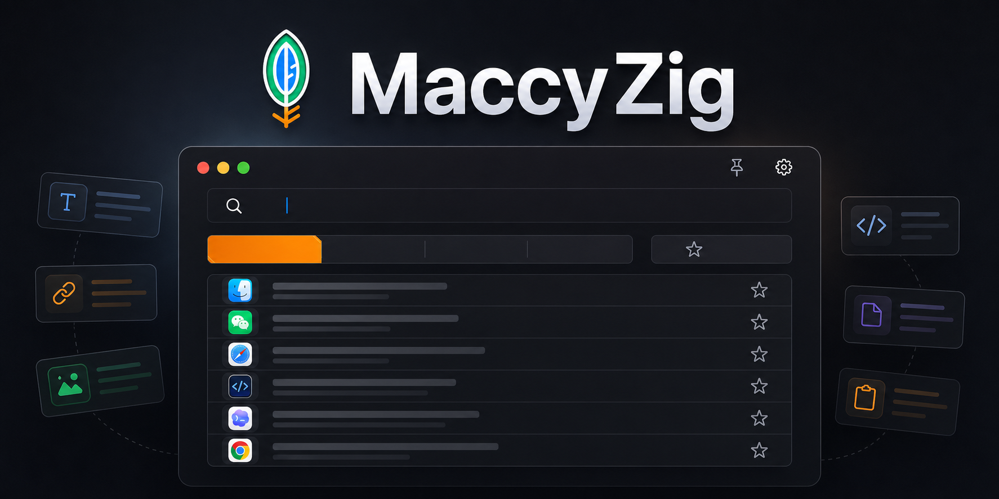

<p align="center">
  
</p>

<h1 align="center">MaccyZig</h1>

<p align="center">
  <a href="README.md">English</a> · <a href="README.zh-CN.md">简体中文</a>
</p>

<p align="center">
  
  
  
  
</p>

MaccyZig helps you find and reuse things you copied on macOS.

It lives in the menu bar, keeps a searchable clipboard history, and lets you quickly paste old text, links, images, and files without switching apps or digging through notes.

## Download

Prebuilt macOS builds are published on the GitHub [Releases](https://github.com/ChaNg1o1/Maccy-zig/releases) page. You can also use the Releases panel on the right side of the repository page.

Download `MaccyZig-*-macOS.zip`, unzip it, then move `Maccy.app` to `/Applications`.

## What You Can Do

- Open clipboard history from the macOS menu bar.
- Search recent copied text, links, images, and files.
- Paste an item normally, or paste it as plain text.
- Mark important items as favorites so they stay around.
- Preview copied images before using them.
- Clear old unpinned items when the history gets noisy.
- Configure the history limit from the settings menu.
- Resize the window and keep that size next time.
- Switch the interface between English and Simplified Chinese.

## For Developers

MaccyZig is built with Zig, Objective-C, AppKit, Cocoa, and SQLite. The repository also includes CLI commands for capture, watch, stats, listing, benchmarking, and importing existing Maccy data.

## Requirements

- macOS 14 or newer to run the app.
- Zig `0.16.0` or a compatible recent build to build from source.
- Xcode Command Line Tools to compile the macOS bridge code.
- ImageMagick (`magick`) to package the menu bar icon.
- A valid Apple Development signing identity, or the ad-hoc signing fallback used by the packaging script.

Install common prerequisites:

```sh
xcode-select --install
brew install imagemagick
```

## Build

Build the debug/development binary:

```sh
zig build
```

Run the app from the build output:

```sh
zig build run
```

Build an optimized release binary:

```sh
zig build -Doptimize=ReleaseFast
```

## Package The App

Create `dist/Maccy.app`:

```sh
./scripts/package-app.sh
```

The packaging script:

- builds `maccy-zig` in `ReleaseFast`
- creates the app bundle under `dist/Maccy.app`
- copies `resources/Info.plist`
- generates `AppIcon.icns`
- renders the menu bar template image from `assets/menubar.svg`
- signs the app with `CODESIGN_IDENTITY`, the first Apple Development identity, or ad-hoc signing

To force a specific signing identity:

```sh
CODESIGN_IDENTITY="Apple Development: Your Name (TEAMID)" ./scripts/package-app.sh
```

## Install Locally

There is no signed public download yet. To try the app today, build it from source and install the packaged app locally.

Replace `/Applications/Maccy.app` with the newly packaged build:

```sh
./scripts/install-replace.sh
```

This script is intentionally cautious:

- packages the app
- imports existing Maccy clipboard history when available
- backs up the existing `/Applications/Maccy.app`
- backs up original Maccy SQLite/preferences data
- writes a `restore.sh` script into the backup directory
- installs and opens the new app

Backups are written to:

```text
~/Backups/MaccyZig-YYYYMMDD-HHMMSS/
```

To restore the previous app after an install:

```sh
~/Backups/MaccyZig-YYYYMMDD-HHMMSS/restore.sh
```

## Developer CLI

Show help:

```sh
./zig-out/bin/maccy-zig --help
```

Capture the current pasteboard once:

```sh
zig build run -- once
```

Watch the pasteboard continuously:

```sh
./zig-out/bin/maccy-zig watch --max-blob-mib 4
```

List stored history rows:

```sh
./zig-out/bin/maccy-zig list
```

Show storage statistics:

```sh
./zig-out/bin/maccy-zig stats
```

Use a custom database path:

```sh
./zig-out/bin/maccy-zig watch --db /tmp/maccy-zig.sqlite
```

Useful options:

```text
--db PATH            SQLite path
--interval-ms N      Watch polling interval, default 500
--max-items N        Unpinned history cap, default 500
--max-blob-mib N     Skip individual pasteboard blobs above N MiB, default 16
--max-age-days N     Auto-delete unpinned items older than N days, default 0 = off
--no-images          Store text/html/rtf/file URLs only
```

## Verification

Run unit tests:

```sh
zig build test
```

Smoke test the packaged app bundle:

```sh
./scripts/smoke-package.sh
```

Smoke test app launch:

```sh
./scripts/smoke-bundle-launch.sh
```

Generated verification artifacts are written to:

```text
dist/verification/
```

## Release Builds

Release builds are created by GitHub Actions when a tag like `v0.1.0` is pushed, or when the `Release` workflow is run manually from the Actions tab.

Each release includes:

- `MaccyZig-<tag>-macOS.zip`
- `MaccyZig-<tag>-macOS.zip.sha256`
- release notes with a small ASCII logo and install notes

## Project Layout

```text
.
├── build.zig
├── assets/
│   ├── logo.png
│   ├── logo-mark.png
│   ├── logo-thumb.png
│   └── menubar.svg
├── resources/
│   └── Info.plist
├── scripts/
│   ├── package-app.sh
│   ├── install-replace.sh
│   ├── smoke-package.sh
│   └── smoke-bundle-launch.sh
└── src/
    ├── main.zig
    ├── capture_service.zig
    ├── storage.zig
    ├── macos_app.m
    ├── macos_clipboard.m
    ├── macos_hotkey.m
    └── macos_paste.m
```

## Data Storage

Default database path:

```text
~/Library/Application Support/MaccyZig/Storage.sqlite
```

The database uses WAL mode and stores metadata in `history_items` and pasteboard payloads in `history_contents`.

## Permissions

Like other clipboard managers, the app reads the system pasteboard. Pasting into other apps may require macOS Accessibility permissions depending on the paste path and target application.

If paste actions do not work, open:

```text
System Settings -> Privacy & Security -> Accessibility
```

Then add or enable `Maccy.app`.

## Shipping Checklist

Before publishing a release on GitHub:

- Run `zig build test`.
- Run `./scripts/smoke-package.sh`.
- Run `./scripts/smoke-bundle-launch.sh`.
- Verify the packaged app on a clean macOS account or machine.
- Decide whether the bundle identifier should remain `org.p0deje.Maccy` or use a project-specific identifier.

## License

MaccyZig is available under the MIT License. See [LICENSE](LICENSE).
